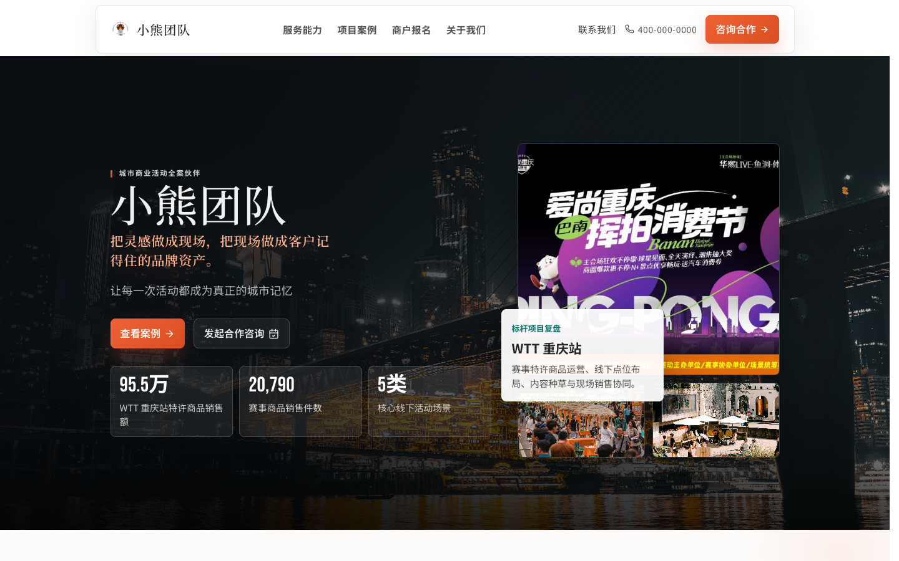
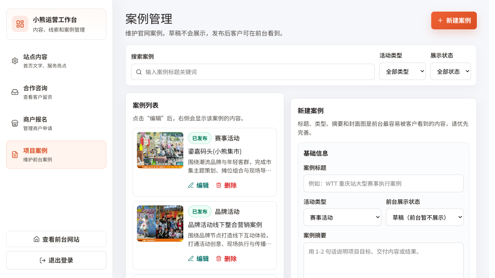

# Bear Fest / 小熊团队官网与运营后台

Bear Fest 是一个面向活动服务公司的企业官网与运营后台项目。它既能作为对外客户展示站，介绍服务能力、项目案例和合作入口，也能作为内部运营工作台，管理站点内容、合作咨询、商户报名和案例发布。

## 项目预览

### 官网首页



### 运营后台



## 项目定位

这个项目主要解决三件事：

- 对外展示公司能力：通过首页、服务能力、项目案例、关于我们等页面建立专业形象。
- 收集合作线索：客户可以在线提交合作咨询，商户可以在线报名并上传店铺图片。
- 支撑运营维护：后台可维护首页内容、查看线索、处理商户报名、创建和发布项目案例。

## 技术栈

- 后端：`FastAPI`、`SQLAlchemy`、`SQLite`
- 前端：`React`、`Vite`、`React Router`
- UI：普通 CSS + 少量 `lucide-react` 图标
- 数据库：默认使用项目根目录的 `app.db`

## 主要功能

### 官网前台

- 首页：品牌主视觉、服务能力、关键数据、代表案例、合作 CTA。
- 服务能力：活动全链路能力、合作模式、交付流程、保障说明。
- 项目案例：按活动类型筛选案例，查看案例详情。
- 关于我们：公司介绍、团队结构、能力生态。
- 联系我们：提交合作咨询线索。
- 商户报名：提交商户资料并上传店铺图片。

### 运营后台

- 站点内容：维护首页标题、说明文字、服务亮点和联系方式。
- 合作咨询：查看客户留资，按状态筛选，标记跟进进度，导出表格。
- 商户报名：查看报名资料、附件和处理状态，导出表格。
- 项目案例：新建、编辑、删除、发布或下线案例。
- 管理员登录：使用 JWT 鉴权保护后台页面和后台接口。

## 项目结构

```text
bear-fest/
├── app/                         # FastAPI 后端
│   ├── api/                     # 前台与后台 API
│   ├── auth/                    # 管理员登录、JWT、密码校验
│   ├── config/                  # 环境配置
│   ├── model/                   # SQLAlchemy 数据模型
│   ├── schema/                  # Pydantic Schema
│   └── init_db.py               # 数据库初始化
├── frontend/                    # React 前端
│   ├── public/                  # 静态图片素材
│   └── src/
│       ├── pages/               # 官网页面与后台页面
│       ├── components/          # 公共布局与 UI 组件
│       ├── admin/               # 后台鉴权与请求封装
│       └── index.css            # 全局样式
├── docs/                        # 产品、系统、数据库设计文档与截图
│   └── screenshots/             # README 展示截图
├── app.db                       # 本地 SQLite 示例数据库
├── requirements.txt             # Python 依赖
└── README.md
```

## 环境要求

- Python 3.10+
- Node.js 18+
- npm 9+

## 快速启动

### 1. 安装后端依赖

在项目根目录执行：

```bash
python3 -m venv .venv
source .venv/bin/activate
pip install -r requirements.txt
```

### 2. 启动后端

```bash
uvicorn app.main:app --reload --host 0.0.0.0 --port 8000
```

启动后可访问：

- 健康检查：`http://127.0.0.1:8000/health`
- API 文档：`http://127.0.0.1:8000/docs`

### 3. 安装前端依赖

新开一个终端：

```bash
cd frontend
npm install
```

### 4. 启动前端

```bash
npm run dev
```

默认访问：

- 官网首页：`http://127.0.0.1:5173/`
- 运营后台：`http://127.0.0.1:5173/admin/login`

## 前后端联调

前端会通过 `VITE_API_BASE_URL` 请求后端。未显式配置时，会默认请求当前页面主机名的 `8000` 端口。

如果需要指定后端地址，可以这样启动：

```bash
cd frontend
VITE_API_BASE_URL=http://127.0.0.1:8000 npm run dev
```

## 后台账号说明

本地示例数据库 `app.db` 中包含一个演示管理员账号：

```text
账号：admin
密码：admin
```

仅用于本地演示。正式部署时请重新初始化管理员账号，并使用更强的密码。

如果是全新数据库，可以在首次初始化前通过环境变量设置管理员：

```bash
ADMIN_BOOTSTRAP_USERNAME=admin ADMIN_BOOTSTRAP_PASSWORD=your-strong-password python3 -m app.init_db
```

## 常用命令

```bash
# 前端构建
cd frontend
npm run build

# 后端语法检查
python3 -m compileall app

# 初始化数据库
python3 -m app.init_db
```

## API 概览

### 前台 API

- `GET /health`：服务健康检查
- `GET /api/v1/site-config`：获取站点配置
- `GET /api/v1/cases`：获取案例列表，支持 `event_type` 筛选
- `GET /api/v1/cases/{slug}`：获取案例详情
- `POST /api/v1/leads`：提交合作咨询
- `POST /api/v1/merchant-signups`：提交商户报名

### 后台 API

- `POST /api/admin/login`：管理员登录
- `GET /api/admin/site-config`：读取站点配置
- `PUT /api/admin/site-config`：更新站点配置
- `GET /api/admin/leads`：查询合作咨询
- `PATCH /api/admin/leads/{lead_id}`：更新咨询状态
- `GET /api/admin/merchant-signups`：查询商户报名
- `PATCH /api/admin/merchant-signups/{signup_id}`：更新报名状态
- `GET /api/admin/cases`：查询后台案例
- `POST /api/admin/cases`：创建案例
- `PUT /api/admin/cases/{case_id}`：更新案例
- `DELETE /api/admin/cases/{case_id}`：删除案例

## 数据与素材说明

- `frontend/public/case-carousel/`：官网和案例页使用的活动图片素材。
- `frontend/public/chongqing/`：重庆城市背景素材。
- `docs/wtt/`：WTT 项目复盘 PDF 原始资料。
- `docs/screenshots/`：README 展示截图。
- `app/uploads/merchant/`：商户报名上传文件保存目录。

## 部署提醒

- 正式环境不要使用默认管理员密码。
- `app/config/config_prod.yml` 应设置独立的 JWT 密钥。
- 如果前端和后端域名不同，需要配置正确的 `VITE_API_BASE_URL`。
- SQLite 适合本地演示；正式生产建议迁移到 PostgreSQL 或 MySQL。

## 相关文档

- [产品设计文档](docs/product-design.md)
- [系统设计文档](docs/system-design.md)
- [数据库设计文档](docs/database-design.md)
