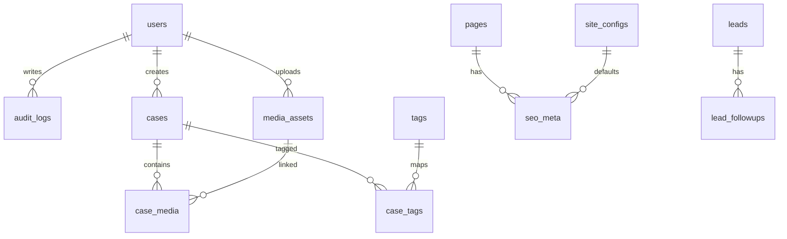

# 小熊集市官网数据库设计文档

## 1. 文档目标

本文档定义官网后端（Python + PostgreSQL）的数据库设计方案，覆盖：

- 逻辑模型与表关系
- 表结构（字段、约束、索引）
- 典型查询与索引策略
- 数据生命周期与归档策略
- 迁移规范与初始化数据建议

## 2. 设计原则

- 面向内容展示与线索沉淀，优先保证查询稳定与可维护
- 结构化字段优先，必要时使用 JSONB 承载可扩展配置
- 所有业务表统一审计字段：`created_at`、`updated_at`
- 尽量软删除（`deleted_at`）避免误删导致线上内容缺失
- 明确唯一性与外键约束，避免“脏数据”

## 3. 数据库选型与命名规范

## 3.1 选型

- 数据库：PostgreSQL 15+
- 字符集：UTF-8
- 时区：统一存储为 UTC，应用层按 `Asia/Shanghai` 展示

## 3.2 命名规范

- 表名：`snake_case` 复数形式，如 `cases`、`leads`
- 主键：统一 `id`，类型 `bigserial` 或 `uuid`（建议统一 UUID）
- 外键：`{ref_table_singular}_id`
- 索引命名：`idx_{table}_{field}`；唯一索引：`uk_{table}_{field}`

## 4. 逻辑模型（ER）

说明：
- `cases` 为案例核心实体；
- `media_assets` 与 `case_media` 支撑案例图集和排序；
- `leads` 管理官网咨询线索，`lead_followups` 记录跟进历史；
- `pages` + `seo_meta` 支撑页面级 SEO 配置。

## 5. 物理表设计

以下字段类型基于 PostgreSQL，`NOT NULL`/默认值已在说明中体现。

## 5.1 用户与权限

### `users`（后台用户）

- `id` uuid PK
- `email` varchar(255) NOT NULL UNIQUE
- `password_hash` varchar(255) NOT NULL
- `display_name` varchar(100) NOT NULL
- `role` varchar(32) NOT NULL（`operator`/`admin`）
- `status` varchar(32) NOT NULL DEFAULT `active`
- `last_login_at` timestamptz NULL
- `created_at` timestamptz NOT NULL DEFAULT now()
- `updated_at` timestamptz NOT NULL DEFAULT now()
- `deleted_at` timestamptz NULL

索引：
- `uk_users_email`
- `idx_users_role_status` (`role`, `status`)

## 5.2 案例主表

### `cases`

- `id` uuid PK
- `title` varchar(200) NOT NULL
- `slug` varchar(200) NOT NULL UNIQUE
- `event_type` varchar(32) NOT NULL（`sports`/`carnival`/`market`/`annual`/`brand`）
- `summary` varchar(500) NOT NULL
- `content` text NOT NULL（富文本或 Markdown 渲染源）
- `cover_media_id` uuid NULL FK -> `media_assets.id`
- `publish_status` varchar(32) NOT NULL DEFAULT `draft`
- `published_at` timestamptz NULL
- `sort_order` int NOT NULL DEFAULT 0
- `view_count` bigint NOT NULL DEFAULT 0
- `seo_title` varchar(255) NULL
- `seo_description` varchar(500) NULL
- `created_by` uuid NOT NULL FK -> `users.id`
- `updated_by` uuid NOT NULL FK -> `users.id`
- `created_at` timestamptz NOT NULL DEFAULT now()
- `updated_at` timestamptz NOT NULL DEFAULT now()
- `deleted_at` timestamptz NULL

约束：
- `publish_status` in (`draft`, `published`, `offline`)
- 当 `publish_status = 'published'` 时，`published_at` 必须非空（应用层+DB check 双保）

索引：
- `uk_cases_slug`
- `idx_cases_event_type_status_pubat` (`event_type`, `publish_status`, `published_at` desc)
- `idx_cases_status_sort_order` (`publish_status`, `sort_order`)
- `idx_cases_deleted_at` (`deleted_at`)

## 5.3 标签体系

### `tags`

- `id` uuid PK
- `name` varchar(50) NOT NULL UNIQUE
- `created_at` timestamptz NOT NULL DEFAULT now()

### `case_tags`（多对多关系）

- `id` uuid PK
- `case_id` uuid NOT NULL FK -> `cases.id`
- `tag_id` uuid NOT NULL FK -> `tags.id`
- `created_at` timestamptz NOT NULL DEFAULT now()

唯一约束：
- `uk_case_tags_case_id_tag_id` (`case_id`, `tag_id`)

索引：
- `idx_case_tags_case_id`
- `idx_case_tags_tag_id`

## 5.4 媒体资源

### `media_assets`

- `id` uuid PK
- `bucket` varchar(100) NOT NULL
- `object_key` varchar(500) NOT NULL UNIQUE
- `cdn_url` varchar(1000) NOT NULL
- `media_type` varchar(32) NOT NULL（`image`/`video`）
- `mime_type` varchar(100) NOT NULL
- `size_bytes` bigint NOT NULL
- `width` int NULL
- `height` int NULL
- `duration_sec` int NULL（视频）
- `uploaded_by` uuid NOT NULL FK -> `users.id`
- `created_at` timestamptz NOT NULL DEFAULT now()
- `deleted_at` timestamptz NULL

索引：
- `uk_media_assets_object_key`
- `idx_media_assets_media_type_created_at` (`media_type`, `created_at` desc)

### `case_media`（案例图集）

- `id` uuid PK
- `case_id` uuid NOT NULL FK -> `cases.id`
- `media_id` uuid NOT NULL FK -> `media_assets.id`
- `position` int NOT NULL DEFAULT 0
- `caption` varchar(255) NULL
- `created_at` timestamptz NOT NULL DEFAULT now()

唯一约束：
- `uk_case_media_case_id_media_id` (`case_id`, `media_id`)

索引：
- `idx_case_media_case_id_position` (`case_id`, `position`)

## 5.5 页面与站点配置

### `site_configs`

- `id` uuid PK
- `config_key` varchar(100) NOT NULL UNIQUE（如 `home`、`contact`）
- `config_value` jsonb NOT NULL
- `updated_by` uuid NOT NULL FK -> `users.id`
- `created_at` timestamptz NOT NULL DEFAULT now()
- `updated_at` timestamptz NOT NULL DEFAULT now()

索引：
- `uk_site_configs_config_key`
- `idx_site_configs_updated_at` (`updated_at` desc)

### `pages`

- `id` uuid PK
- `page_key` varchar(100) NOT NULL UNIQUE（`home`/`services`/`cases`/`about`/`contact`）
- `title` varchar(200) NOT NULL
- `path` varchar(200) NOT NULL UNIQUE
- `publish_status` varchar(32) NOT NULL DEFAULT `published`
- `created_at` timestamptz NOT NULL DEFAULT now()
- `updated_at` timestamptz NOT NULL DEFAULT now()

### `seo_meta`

- `id` uuid PK
- `page_id` uuid NULL FK -> `pages.id`
- `ref_type` varchar(32) NOT NULL（`page`/`case`/`default`）
- `ref_id` uuid NULL（当 `ref_type=case` 对应 `cases.id`）
- `seo_title` varchar(255) NULL
- `seo_description` varchar(500) NULL
- `keywords` varchar(500) NULL
- `og_image_media_id` uuid NULL FK -> `media_assets.id`
- `canonical_url` varchar(1000) NULL
- `created_at` timestamptz NOT NULL DEFAULT now()
- `updated_at` timestamptz NOT NULL DEFAULT now()

索引：
- `idx_seo_meta_ref_type_ref_id` (`ref_type`, `ref_id`)
- `idx_seo_meta_page_id` (`page_id`)

## 5.6 线索与跟进

### `leads`

- `id` uuid PK
- `name` varchar(100) NOT NULL
- `company` varchar(200) NULL
- `contact_type` varchar(20) NOT NULL（`phone`/`email`/`wechat`）
- `contact_value` varchar(255) NOT NULL
- `demand_desc` text NOT NULL
- `source_page` varchar(200) NOT NULL
- `utm_source` varchar(100) NULL
- `utm_medium` varchar(100) NULL
- `utm_campaign` varchar(100) NULL
- `client_ip` inet NULL
- `user_agent` varchar(1000) NULL
- `status` varchar(32) NOT NULL DEFAULT `new`
- `assigned_to` uuid NULL FK -> `users.id`
- `created_at` timestamptz NOT NULL DEFAULT now()
- `updated_at` timestamptz NOT NULL DEFAULT now()
- `deleted_at` timestamptz NULL

约束：
- `status` in (`new`, `following`, `closed`)

索引：
- `idx_leads_status_created_at` (`status`, `created_at` desc)
- `idx_leads_source_page_created_at` (`source_page`, `created_at` desc)
- `idx_leads_utm_campaign` (`utm_campaign`)

### `lead_followups`

- `id` uuid PK
- `lead_id` uuid NOT NULL FK -> `leads.id`
- `operator_id` uuid NOT NULL FK -> `users.id`
- `content` text NOT NULL
- `next_action_at` timestamptz NULL
- `created_at` timestamptz NOT NULL DEFAULT now()

索引：
- `idx_lead_followups_lead_id_created_at` (`lead_id`, `created_at` desc)

## 5.7 审计日志

### `audit_logs`

- `id` uuid PK
- `operator_id` uuid NOT NULL FK -> `users.id`
- `action` varchar(100) NOT NULL（如 `create_case`、`publish_case`）
- `target_type` varchar(50) NOT NULL（`case`/`lead`/`config`）
- `target_id` uuid NULL
- `change_set` jsonb NULL（字段变更快照）
- `request_id` varchar(100) NULL
- `ip` inet NULL
- `created_at` timestamptz NOT NULL DEFAULT now()

索引：
- `idx_audit_logs_operator_created_at` (`operator_id`, `created_at` desc)
- `idx_audit_logs_target` (`target_type`, `target_id`)

## 6. 关键查询与索引映射

- 案例列表页（按类型+发布时间）：走 `idx_cases_event_type_status_pubat`
- 首页精选案例（已发布+排序）：走 `idx_cases_status_sort_order`
- 案例详情（slug）：走 `uk_cases_slug`
- 后台线索列表（状态+时间）：走 `idx_leads_status_created_at`
- 线索来源分析（source_page）：走 `idx_leads_source_page_created_at`

## 7. 数据一致性与事务策略

- 发布案例流程使用事务：更新 `cases` + 写入 `audit_logs`
- 删除媒体前检查 `cases.cover_media_id` 与 `case_media` 引用关系
- 表单提交（`leads`）与风控日志写入采用同事务（若存在风控表）
- 外键默认 `ON DELETE RESTRICT`，避免误删除联动丢数据

## 8. 数据生命周期管理

- `audit_logs`：保留 12-24 个月，可按月分区归档
- `leads`：长期保留；若涉及隐私合规，可增加脱敏任务
- `deleted_at` 不为空的数据，定期离线备份后物理清理
- 媒体主数据与对象存储做周期一致性校验（防孤儿文件）

## 9. 安全与合规要求

- 敏感字段（联系方式）按需加密存储或脱敏展示
- 最小权限原则：应用账号仅授予 DML 与必要 DDL 权限
- 生产库启用定时备份（全量 + 增量/WAL）
- 关键变更（发布、下线、配置变更）必须写入 `audit_logs`

## 10. 迁移与版本管理

- 使用 Alembic 管理迁移，禁止手工改生产表
- 迁移脚本命名建议：`{timestamp}_{module}_{action}.py`
- 每次迁移需包含：
  - `upgrade` 与 `downgrade`
  - 索引/约束创建语句
  - 必要的数据回填脚本

建议迁移顺序：
1. 基础表：`users`、`pages`
2. 内容域：`media_assets`、`cases`、`tags`、`case_tags`、`case_media`
3. 配置域：`site_configs`、`seo_meta`
4. 线索域：`leads`、`lead_followups`
5. 审计域：`audit_logs`

## 11. 初始化数据建议（Seed）

- 创建默认管理员账号（首次登录强制改密）
- 初始化 `pages`：`home/services/cases/about/contact`
- 初始化 `site_configs`：首页 hero、联系方式占位配置
- 初始化标签（赛事、嘉年华、潮流集市、年会、品牌活动）

## 12. 验收清单

- 所有 P0 表结构、主外键、唯一约束完成
- 关键查询均命中预期索引（`EXPLAIN ANALYZE` 验证）
- Alembic 全量迁移可在空库一键执行成功
- 回滚脚本可在 staging 环境验证通过
- 样例数据可支持前后端联调完整主流程
