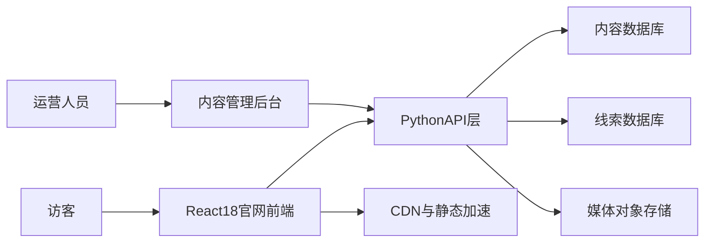

# 小熊集市官网系统设计文档

## 1. 项目背景与愿景

小熊集市是小熊集市旗下活动服务平台，专注于大型赛事活动、主题嘉年华、潮流集市、企业年会与品牌活动的策划与落地执行。官网目标是以品牌展示为核心，统一传达平台价值、服务能力与代表案例，支撑品牌合作方与城市合作方的信任建立与合作转化。

### 1.1 品牌主张

- 打造城市中最具活力的线下活动生态
- 提供从创意设计到现场运营的一站式活动解决方案
- 让每一次活动成为城市记忆，让每个灵感都在现场被看见

### 1.2 建设目标

- 以强视觉叙事和案例表达凸显品牌专业度
- 沉淀可持续运营的内容资产，支持活动案例持续更新
- 通过咨询入口沉淀潜在客户线索，支持后续销售跟进

## 2. 业务目标与成功指标

## 2.1 业务目标

- **品牌展示优先**：首页与案例页面能够快速建立“专业、可靠、有创意”的品牌认知
- **兼顾转化**：提供清晰联系路径（表单、电话、微信/邮箱），提升合作咨询率
- **可运营增长**：支持后续案例新增、内容更新、SEO扩展和活动专题化运营

## 2.2 核心KPI（上线后3个月）

- 官网月独立访客（UV）达到目标值（由市场团队定义）
- 核心页面平均停留时长 >= 90 秒
- 首页到“联系我们”页面跳转率 >= 8%
- 咨询表单提交转化率 >= 2%
- 案例页自然搜索流量逐月增长

## 3. 用户角色与核心场景

## 3.1 用户角色

- **品牌方市场负责人**：关注活动策划能力、落地案例、执行保障能力
- **城市合作方/场地方**：关注平台资源整合、组织能力与城市影响力
- **潜在参与者与公众**：关注活动氛围、品牌调性与社会热度
- **内部运营人员**：维护官网内容、发布案例、查看咨询线索

## 3.2 核心场景

- 访客首次访问官网，快速理解小熊集市定位与服务范围
- 访客浏览代表案例（如 WTT 重庆站）并形成合作意向
- 访客通过联系入口提交需求，后台沉淀线索并通知商务人员
- 运营人员在后台维护案例、图片视频和首页内容模块

## 4. 信息架构与页面蓝图

## 4.1 站点信息架构

- 首页
- 服务能力
- 项目案例
- 关于我们
- 联系我们

## 4.2 页面蓝图

### 首页（品牌叙事主阵地）

- 顶部品牌价值主视觉（Hero）
- 核心服务能力概览
- 代表案例卡片区
- 数据化背书（活动数量、覆盖城市、合作品牌等）
- 客户证言/合作品牌墙
- 联系引导模块（CTA）

### 服务能力页

- 服务流程：创意设计 -> 场景搭建 -> 供应链协作 -> 活动传播 -> 现场运营
- 细分服务说明与交付边界
- 常见合作模式（整包、联合共创、专项执行）

### 项目案例页

- 案例列表（支持按活动类型筛选）
- 案例详情（项目背景、目标、执行亮点、现场成果、媒体素材）
- 相关推荐案例

### 关于我们页

- 团队与发展历程
- 企业理念与社会价值
- 资质与合作生态

### 联系我们页

- 咨询表单（姓名、公司、联系方式、需求描述）
- 联系方式与商务渠道
- 地图/办公地址信息（可选）

## 5. 功能需求与优先级

## 5.1 MVP（首期上线）

- 多页面展示：首页/服务能力/案例/关于我们/联系我们
- 案例管理：后台可新增、编辑、上下线案例
- 素材管理：支持图片与视频链接管理
- 咨询表单提交与后台线索记录
- SEO基础能力：标题、描述、OG、站点地图、robots
- 访问统计埋点（页面浏览、CTA点击、表单提交）

## 5.2 Phase 2（二期）

- 多语言版本（中英）
- 案例专题页（大型赛事专题、年度活动专题）
- CMS可视化模块编排
- 线索自动分配与CRM打通
- A/B测试与个性化推荐

## 6. 技术架构设计

## 6.1 总体架构

## 6.2 技术选型建议

- **前端**：React18 + Vite + React Router
- **样式体系**：Tailwind CSS 或 CSS Modules（根据设计团队习惯选择）
- **后端**：Python + FastAPI（提供内容与线索API）
- **数据库**：PostgreSQL（内容、线索、运营配置）
- **缓存**：Redis（热点内容缓存、接口加速）
- **对象存储**：S3兼容存储（图片、视频封面）
- **加速与分发**：CDN（静态资源与媒体加速）
- **部署**：Docker + Nginx + CI/CD（GitHub Actions/GitLab CI）

## 6.3 前后端职责划分

- 前端负责页面渲染、交互动效、内容展示与SEO元信息拼装
- 后端负责内容管理API、线索管理API、鉴权、审计日志与统计聚合
- 管理后台基于同一后端API，支持运营配置与内容维护

## 7. 核心数据模型与接口约定

## 7.1 核心数据模型（简化）

### Case（项目案例）

- id: string
- title: string
- slug: string
- event_type: enum（sports/carnival/market/annual/brand）
- summary: string
- cover_image_url: string
- gallery_urls: string[]
- publish_status: enum（draft/published/offline）
- published_at: datetime
- tags: string[]
- seo_title: string
- seo_description: string

### Lead（咨询线索）

- id: string
- name: string
- company: string
- phone_or_email: string
- demand_desc: string
- source_page: string
- created_at: datetime
- status: enum（new/following/closed）

### SiteConfig（站点配置）

- id: string
- home_hero_title: string
- home_hero_subtitle: string
- service_highlights: json
- contact_channels: json

## 7.2 API 设计（示例）

- `GET /api/v1/site-config`：获取站点配置
- `GET /api/v1/cases`：分页获取案例列表，支持类型筛选
- `GET /api/v1/cases/{slug}`：获取案例详情
- `POST /api/v1/leads`：提交咨询线索
- `POST /api/v1/admin/cases`：后台创建案例（需鉴权）
- `PUT /api/v1/admin/cases/{id}`：后台更新案例（需鉴权）

## 7.3 接口规范

- 统一返回结构：`{ code, message, data, request_id }`
- 所有写接口带防重放与基础限流
- 管理端接口采用JWT或Session鉴权，记录操作者与变更日志

## 8. SEO 与内容运营策略

- SSR/预渲染策略保障搜索引擎抓取质量（品牌词、案例词）
- 页面级SEO字段可配置（title、description、keywords、OG image）
- 自动生成 `sitemap.xml` 与 `robots.txt`
- 案例详情页使用结构化数据（Organization/Event/Article）
- URL语义化（`/cases/{slug}`），增强内容可发现性

## 9. 非功能需求

## 9.1 性能

- 首屏LCP <= 2.5s（核心页面）
- 图片按设备分辨率分发，启用WebP/AVIF优先策略
- JS分包与懒加载，非关键组件按需加载
- 后端接口P95响应 <= 300ms（缓存命中场景）

## 9.2 安全

- 表单接口防刷（验证码/限流/黑名单策略）
- 输入校验与XSS/SQL注入防护
- 后台RBAC权限分级（运营、管理员）
- HTTPS全站启用，敏感配置通过环境变量管理

## 9.3 可用性与可观测性

- SLA目标：99.9%
- 接口与前端错误统一上报（Sentry/ELK）
- 日志分级（INFO/WARN/ERROR）与链路追踪（request_id）
- 核心告警：接口错误率、表单失败率、CDN命中率异常

## 10. 部署与发布方案

## 10.1 环境划分

- dev：开发联调
- staging：预发验收
- prod：线上生产

## 10.2 发布流程

- 代码合并触发CI（测试、构建、镜像打包）
- 自动部署到staging，验收通过后手动发布prod
- 发布后自动执行健康检查与关键路径巡检

## 10.3 回滚策略

- 保留最近N个稳定镜像版本
- 支持一键回滚到上一稳定版本
- 数据变更采用可回滚迁移脚本（Alembic）

## 11. 实施里程碑与资源评估

- **第1周**：需求确认、信息架构、视觉基线与技术方案冻结
- **第2-3周**：前后端核心功能开发（页面、案例API、线索API、后台）
- **第4周**：联调测试、SEO校验、性能优化、上线准备
- **第5周**：正式上线与数据观察，输出迭代清单

## 12. 风险与应对

- **内容准备不足**：提前建立内容清单与素材模板，锁定责任人
- **上线前性能不达标**：提前设定性能预算并在staging阶段压测
- **表单垃圾提交过多**：增加验证码与WAF规则，按IP/UA限流
- **二期需求膨胀**：明确MVP范围，采用里程碑评审机制控制范围

## 13. 验收标准

- 文档可支持设计、开发、测试、运营共同执行
- 每个核心页面有明确模块定义、数据来源与性能目标
- 技术架构与接口定义可直接进入开发拆解
- 具备可量化上线KPI和阶段性迭代路径
